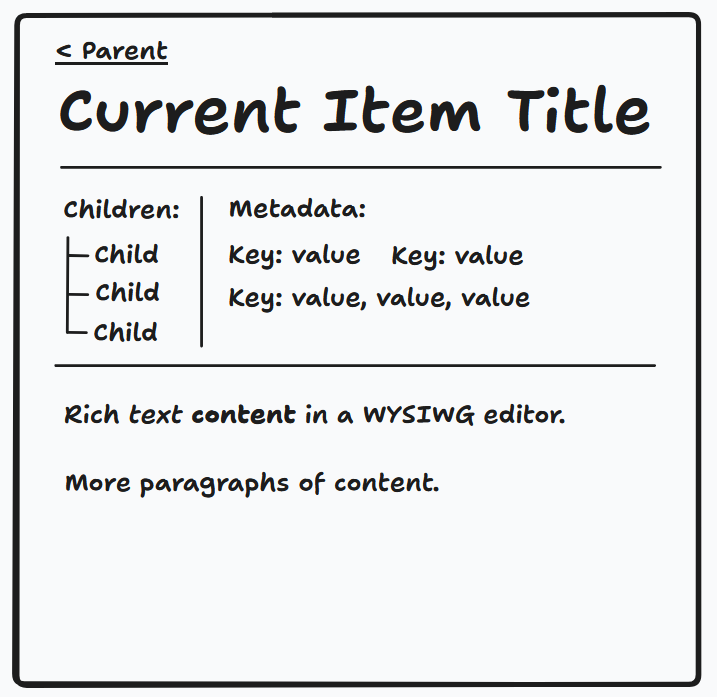

# Downdraft

Downdraft is a simple app for writing and taking notes in an organized way. (Its tagline is "Downdraft: bring ideas down to earth.")

## Content

Downdraft is built around a tree data structure, where each node in the tree has a name, a numerical "position," the ID of a workspace that owns it, and any or none of the following:

- rich text content
- a set of key-value pairs called "metadata"
- and a set of children.

In more detail:

### Nodes

The nodes in the tree are called "leaflets." (They "unfold" to reveal content.) Their names are simple strings. They have unique IDs. They also have timestamps for when they were created and last updated.

#### Rich Text Content

The rich text content is just stored as Markdown.

#### Metadata

The metadata consists of key-value pairs, where the keys are strings and the values are either a string, a sequence of strings, or an empty value (null). (Note that one can easily imagine adding more value types, like numbers or dates, in the future.) For example, a leaflet could have a "Description" key with the value "An essay about migratory birds", or a "Tags" key with the values "birds", "essays", and "migration".

There is also a user-modified set of metadata templates, which can be used to add a bunch of keys (with empty values) to a document that fits within a certain category (for example, there might be a default set of attributes for a blog post, or for a task within a project.) However

#### Children & Positions

Any leaflet can have a set of children. Each leaflet has at most one parent.

This app will store a forest of leaflet trees, not just one. (There is no assumption that all of the content stored by the app is related and should be placed in a single tree.) There is not just one root node; there are many.

Each node also has a "position", which is an integer that indicates its "depth" relative not just to other nodes in its tree, but relative to all of the nodes in all of the trees. Each node has a position one less than that of its parent. The default position is 0. The idea is roughly that most of the content will be concentrated in leaflets that are at position 0; they'll be grouped by their parents that occupy higher positions; and weird sub-notes and digressions will go into the negative numbers.

#### Workspaces

Each node belongs to a "workspace." Workspaces partition nodes, and thus, all content and data.

Each workspace should have a short, unguessable random "code." Anyone who knows what a workspace's code is can read and write the content and data in that workspace. (This is a simplified authorization model, to be used for the first version of the app.)

## User Interface

The first version of Downdraft will be accessible via a simple web app. There are two tabs for this app: the Organizational tab and the Content tab. The Organizational tab is open first, and you can click into it to open a leaflet in the Content tab.

### Organizational Interface

For the initial version of the app, the organizational interface will consist of a tree view of all of the leaflets (the whole forest of trees) that is being stored.

### Content Interface

Here is a very rough mockup of the primary content interface:

The title and the link back to the parent item (if it exists) are fairly self-explanatory. The "Children" and "Metadata" sections only appear if
there is something to show in them; in their absence, subtle "Add Children" and "Add Metadata" buttons will be displayed. The "Children" section should have a maximum height and scroll vertically if the content in it overflows.

#### Text Editor

We need a simple WYSIWYG text editor (and a way to convert its contents to Markdown.) It would be great to polish this and add features, but a standard set of Markdown-friendly formatting options that show up in a tooltip when you highlight some text should be okay for now.

## Changelog

This section tracks updates to the plan and notes whether they've been addressed in the implementation or not. A lack of a checkbox indicates the item has not been addressed at all; a `[ ]` indicates that an attempt has been made to address it, but review and polish may be needed; a `[X]` indicates that the change has fully been incorporated into the implementation.

- Initial plan created
- [ ] Thing one
- [x] Thing two
