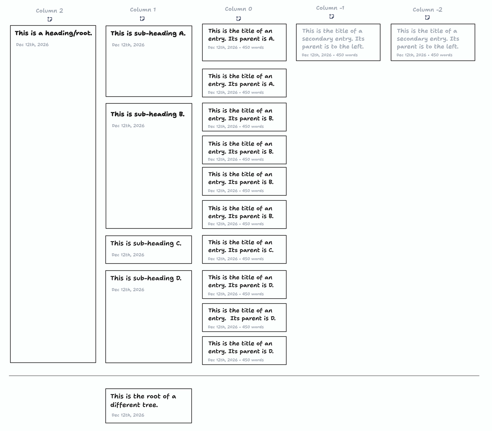
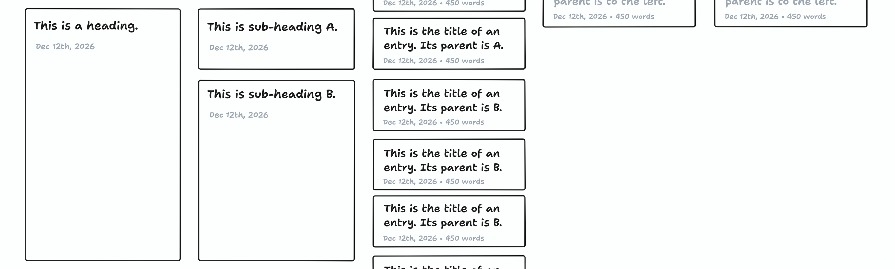
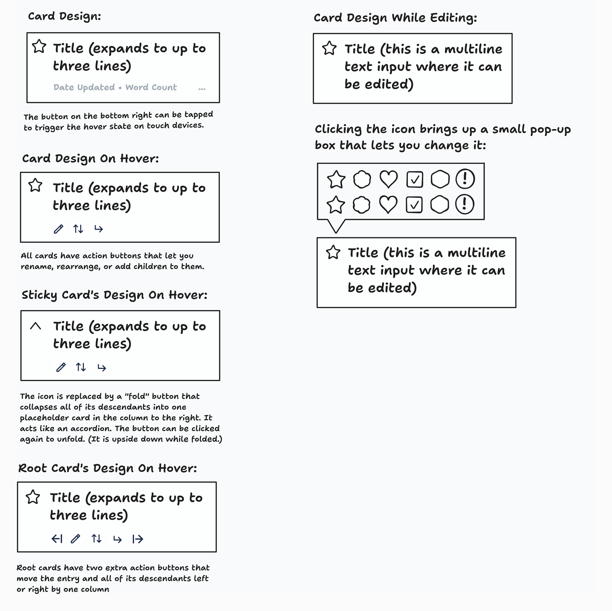
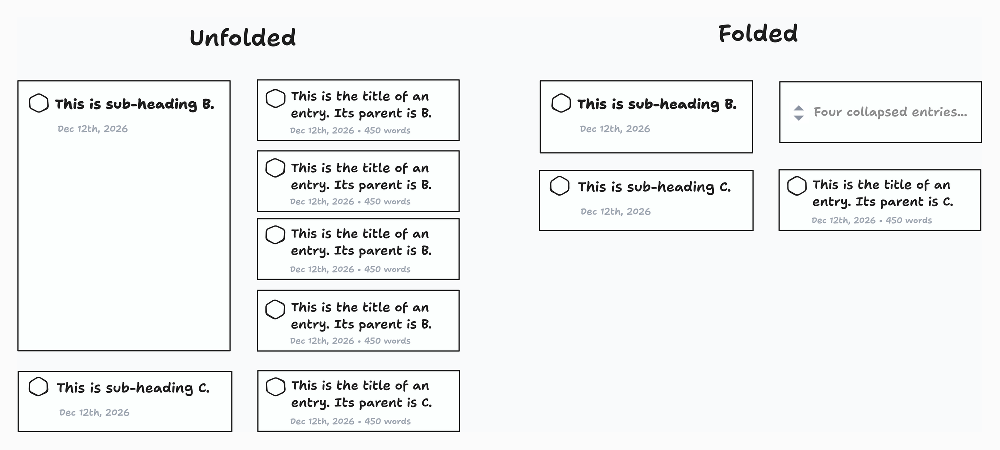
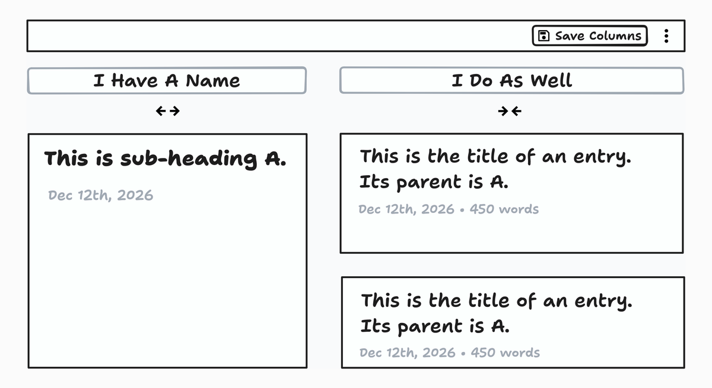
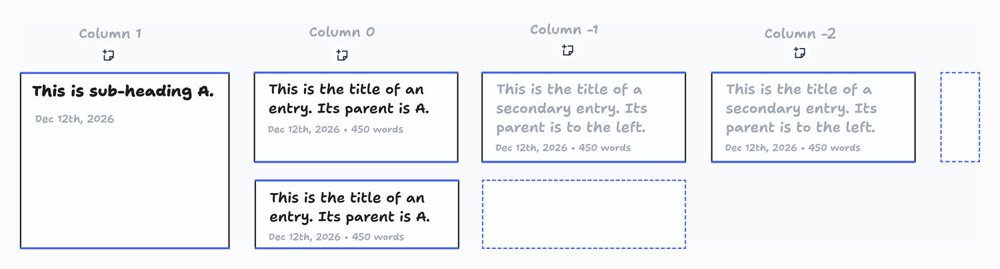

# Frontend

The frontend will use React Router. It will operate in SPA mode. It will fetch and mutate data using React Query and a tRPC client, defaulting to optimistic updates. It will use Tailwind CSS v4 for styling. It should use Remix icons. It should use a consistent set of design tokens for things like colors, fonts, and typographical values; the design tokens are stored in a file called `globals.css`. It should have a clean, minimal, spacious aesthetic.

## Design System

### Colors

Using CSS variables, a palette should be defined, using OKLCH, that consists of several shades of several different colors. These values should then be used to define the tokens that are actually used in the app, like the primary theme color, the primary accent color, the primary and secondary text colors, and so on.

### Text

Font sizes should use rem (and have a base size of 1rem.) 1rem should be defined as 14px on large screens and 12px on mobile. CSS variables should be defined for primary and secondary text colors. Geist (sans) should be used as the primary font. Lora (serif) should be used for accents.

## User Interface

The first version of Logarithmic will be accessible via a simple web app. This app has a splash screen that lets you create a logbook, import a previously exported logbook, or open a logbook that you've previously created. There are two main routes in the logbook view: the organizational route and the content route. The Organizational route is open first, and you can click into it to open an entry's content route.

### Top Bar

Both views have a standard "top bar" that displays the breadcrumbs for the currently open view (which is just the name of the logbook in the organizational view case) and a kebab menu. The breadcrumb trail is led by a link back to the initial splash screen.

When you're in the organizational interface, the kebab menu allows you to rename a logbook via a dialog, enter the column-editing mode (see "Editing Columns" below), or, if it's a not a demo logbook, export it as a ZIP file. When you're on that entry's content page, it allows you to delete an entry or copy it as Markdown (see below.)

### Organizational Interface

The organizational view shows a spreadsheet/chart of all of the entries. Each entry is represented by a simple card in a column. The column numbers are displayed in a row at the top of the page that sticks to the top of the viewport. Only the necessary columns for the cards on screen are shown. Cards' children are present in the column to their right. Cards visually extend downwards to occupy the space taken up by their descendants. There is a horizontal line and a small gap between trees in the forest. (Note that the card designs are slightly simplified in some of these wireframes.)

Column 0 (body text) is rendered wider than the other columns. The chart and the column-number strip are centered horizontally only when there are an equal number of columns greater than 0 and less than 0. When there are more columns greater than 0 that columns less than 0, the content is aligned to the left edge instead; when there are more columns less than 0, it is aligned to the right edge. (This is not shown in the wireframe.) When a logbook loads in on a narrow screen, column 0 is initially horizontally centered.

Entries with more than one child or a descendant with more than one child are "sticky." As you scroll down, their top edge moves down and their content stays on screen as long as any of their descendants are on screen. Also, their bottom edge stays on screen, and is fixed in the same place visually until the last descendant in a column to the right has its bottom edge move above the bottom of the viewport. Here is a mock up with a (very short) viewport:

Note that there is a visible vertical gap between the top of the viewport and the top of the sticky card, and between the bottom of the viewport and the bottom of the sticky card.

Cards in columns greater than 0 have bold titles. (Their font size does not change.) Cards in columns less than 0 have a secondary font color. Cards have sharp, non-rounded corners. Here is the full card design:

All entries that are sticky can also be "folded," which lets you temporarily hide their descendants to free up some space in the viewport.

#### Adding Entries

Creating a new entry adds a new "input cell" to the chart. In the cell, a simple text input is rendered, which the user can type the new entry's name into. (Whenever an input cell is created, it's scrolled into view if necessary.) The entry's icon can also be chosen within the input cell. The new entry is not saved until the input cell loses focus or the user presses enter; also, a non-whitespace name is required to be present in the input. If there is no non-whitespace content in the input at this point, it goes away and no entry is created.

For convenience, if the user presses enter twice after typing the new entry's name, they end up on its page. (In this scenario, they have pressed enter once to save the name, which leaves the link to the new entry present and focused, and once to navigate to that link.)

At the top, where the column numbers are listed, each has a button below it that creates a new entry in that column. That new entry is created as a new root node, positioned after any existing root nodes in the ordering.

One of the buttons on each entry card is the "add child" button. Clicking it adds a child for the entry (inline, in the same manner described above.) (If that entry already has children, the new one will be the new last child.)

#### Editing Entries

Entries can be renamed from the organizational interface using the "Rename" button, which has a pencil as its icon. Clicking it makes an input cell show up. The entry's name can be edited using the same pattern as when the entry is being created; however, if the input cell is empty when the user hits enter or clicks away from it, the edit is simply cancelled and the entry's name is left unchanged.

The icon for an entry is also editable from the input cell; also, for non-sticky entries, the icon can be clicked or tapped to change it at any time. (This is not available for sticky entries only because the "fold" button takes the place of the icon when they're hovered over.)

With regard to adding and editing entries: note that input cells only exist while they're focused, and there should never be a need to render two at once.

#### Editing Columns

Each column's name and width are configurable. By default, a column has no custom name; the name is just displayed as "Column N", where N is its number. Column 0 is wide by default; all others are narrow.

There is an "Edit Columns" item in the kebab menu when in the organizational view. When that's selected, the column number strip changes: each column header gains a text input for its name, and a width-toggle button appears instead of the "Add Entry" button that's normally there. The "Save Columns" action button appears in the top bar next to the kebab while editing.

Editing ends, and the settings are saved, when the user clicks "Save Columns", or presses enter in any column name input.

A column name may be set to an empty string; an empty name is displayed as the default "Column N". If the column name is explicitly set to "Column N", it is persisted as an empty string rather than saving the default name.

Column settings are persisted per logbook on the backend (stored as part of the logbook).

#### Moving Entries

At any point, an entry can be dragged and dropped in order to change its position or parent. If an entry is dropped above another entry, it's moved to be the sibling directly preceding that entry; if it's dropped below another entry, it's moved to be the sibling directly after that entry; and if it's dropped into the "leaf dropzone" for an entry (described below), it is moved to become the new first child of that entry.

While an entry is being dragged, every entry that does not already have children renders a "leaf dropzone" directly to its right (where its children would appear if it had any.) A leaf dropzone takes up the whole width of the next column, except for the ones rendered for entries in the last (right-most, lowest-numbered) visible column; those leaf dropzones are rendered as a narrower stub, so they don't push far into the page's right gutter.

No leaf dropzone is shown for the entry currently being dragged, nor for any entry that is a descendant of the entry currently being dragged, since an entry can't become the child of itself or one of its own descendants.

A well-established drag-and-drop library should be used instead of a purely custom implementation.

If an entry is dragged close to the bottom half of the viewport, the viewport gradually starts scrolling down; same thing for the top.

When an entry is moved (including by giving it a new parent), all of its children are moved with it. Relationally, should happen automatically when operating on most useful representations of the data. However, if represented on its own, the number indicating entries' columns may have to be manually updated to preserve the invariant that a node's column number is always one less than that of its parent (if it has one.)

### Content Interface

The content interface should show an editable version of the entry's title and icon, show its metadata, list its children, and have a text editor for its rich text content.

There should be a focus mode that can be activated to see just the title and the rich text content editor. Activating focus mode takes the browser into full screen mode.

While in focus mode, two unobtrusive controls sit in the top-right corner: a button that toggles full screen on and off, and an X that switches off focus mode completely. (Even if the user exits full screen (by using the toggle button or by pressing Escape), focus mode stays active — only the X switches away from it.)

#### Metadata & Children

There should be a section titled "Metadata" that lists the metadata. Existing metadata attributes can be clicked to edit them, or a new attribute can be added using another inline "Add" button. Adding or editing attributes brings up a modal that lets the type, name, and value(s) for that item be specified. Then, entries' children should be displayed, in a section titled "Subsections." This should list the children, followed by a button that allows an entry to be added inline, following the same interaction pattern as the "Add" button in the organizational view. <!-- TODO: make this act like a subset of the list view that doesn't exist yet, with reordering and title and icon editing from this pane -->

These two sections will collapse down if they don't have content to show. Like this:

- If there are no attributes or children for an entry, all that will be displayed here is two buttons side-by-side (one that lets you add the first child, and one that lets you add the first attribute.)
- If there are no children for an entry, all that is displayed is a button that lets you add a child entry, with no heading.
- Same for the attributes section, which collapses down to just a button that lets you add a new attribute, with no heading, if there are no attributes there yet.

#### Text Editor

For editing entries' rich text, we are using the [Lexical](https://lexical.dev/) editor.

To keep the interface simple, formatting options are presented to the user only when they highlight text or type the "/" character. Both of these actions cause a floating menu to appear.

The available "common" formatting options are: H2, H3, bulleted list, numbered list, and blockquote. These should show up in both of the floating menus described below.

The available inline formatting options are: the common formatting options, bold, italic, underline, strike-through, and links. All of these options should be presented as buttons in a simple floating horizontal toolbar when the user highlights text, with standard rich text editor functionality. There also should be a "clear formatting" button in it.

Inline code formatting is also supported, but only when the user enters Markdown-style backtick (\`) characters, under the assumption that programmers will know to use backticks, no one else will want to format their text like code, and I don't want this app to look like a programmer's tool.

A very simple form will need to take the place of the floating menu when the "link" option is selected. It will have a plain text input for the link URL, a "confirm" button, and a "remove" button. (Also, if you highlight some text and then paste a URL, that text should be converted to a link to that URL.) Note that when part of a link is highlighted, and then the "remove" button is used in the link form or the "clear formatting" button is clicked, the link should only be removed from the text that is highlighted.

<!-- TODO: add a "move to subentry" tool to the floating selection menu, but not yet. Another possible future tool is the ability to add comments. -->

The available block formatting options are: the common formatting options, and the horizontal rule. Selecting any of these options will switch the current block (which may or may not be empty) to that type. (Note that H1 is not a possible option, since the entry title is the highest-level heading.) Typing "/" after a newline or a space will cause a simple vertical menu to appear that offers these options. Similarly to inline code formatting, code blocks can be created only by typing in a code fence (three backticks.) <!-- TODO: add image insertion, but not yet. -->

An extra option in the vertical slash menu is the ability to add a footnote. Footnotes consist of an inline superscript number that is linked to a rich text body that is displayed at the bottom of the document. Within footnotes, the inline-only formatting options should be available. (The slash menu, the "common" formatting options, and the block elements should not be.)

Note that when an inline footnote reference is cut or copied and pasted into another or the same Lexical editor, it needs to take the content of the footnote body with it, with no possibility of losing the content outright (unless, of course, the footnote reference is deleted or cut and then never pasted again.) Similarly, when footnotes are copied and pasted into an external application, their bodies should be placed at the end of the pasted content. (Technical note: this means that the `text/html` and `text/plain` clipboard payloads need to be customized.)

The content should auto-save periodically. It should also save when you press Ctrl-S (or Cmd-S.)

Technical note: When the content is copied as Markdown via the kebab menu, it should be converted using the `@lexical/markdown` package. Custom elements like footnotes should be handled and output in a Markdown-typical way.

## Demo Logbook

The frontend should have zero or more "demo logbooks" that are accessible from the splash screen. This will consist of a series of entries that are not persisted and are not loaded from the API that serve to demonstrate the app's functionality. To facilitate this, data-fetching should be encapsulated in hooks (like `useEntry` and `useLogbookOverview`) that receive the ID of the current logbook, and if that ID matches a demo logbook, the demo data should be returned instead of an API call being made. Mutations should similarly update the demo data that is currently being used.
