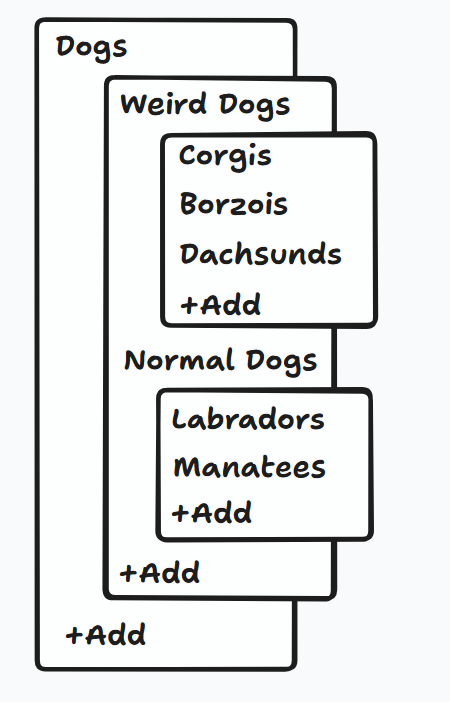

# Frontend

The frontend will use React Router. It will operate in SPA mode. It will fetch and mutate data using React Query and a tRPC client, defaulting to optimistic updates. It will use Tailwind CSS v4 for styling. It should use Remix icons. It should define CSS variables that provide the theme values (using the @theme directive) for the app (colors, borders, spacing) and use them wherever logical. It should have a clean, minimal, spacious aesthetic.

## Design System

### Text

Font sizes should use rem (and have a base size of 1rem.) 1rem should be defined as 14px on large screens and 12px on mobile. CSS variables should be defined for primary and secondary text colors. Geist (sans) should be used as the primary font. Lora (serif) should be used for accents.

## User Interface

The first version of Logarithmic will be accessible via a simple web app. This app has a splash screen that lets you create a logbook or go to a logbook that you've previously created. (All routes except the splash screen should start with a parameter that is the logbook's slug hyphenated with its ID.) There are two main tabs in the logbook view: the Organizational view and the Content view. The Organizational tab is open first, and you can click into it to open a entry in the Content tab.

Both views have a standard "top bar" that displays the breadcrumbs for the currently open view (which is just the name of the logbook in the organizational view case), a "close" button that closes the current logbook and sends the user back to the initial splash screen, and a kebab menu. This menu currently just allows you to delete entries when you're on that entry's content page.

### Organizational Interface

The organizational view shows a spreadsheet/chart of all of the entries. You can tell which column each entry falls into from its horizontal position; each entry is centered under the column number it corresponds to. (The column numbers are displayed in a row at the top of the page that sticks to the top of the viewport.) They are arranged in nested groups of one or more entries, which creates a layout vaguely similar to a file tree. Here is a wireframe:

Each sequence of one or more siblings becomes a group that is placed in a container. If an entry has children, those are placed in their own, separate group that is below its parent and offset to the right. At the end of each group, an "Add" button is displayed.

#### Column-Level Emphasis

The column an entry is in indicates the role it plays in the organizational schema; specific roles for specific columns aren't enforced at a data model level, but their typographic style hints at potential uses.

- Column 0 is like body text; it's the column that most content is concentrated in.
- Columns greater than 0 are like headings, and are emphasized correspondingly; they should be displayed with increased font sizes, weight, and vertical padding.
- Columns less than 0 contain asides, digressions, and half-formed ideas. They use the default font size (1rem), but the secondary text color.

Make sure that these values are stored as CSS variables so that they can be experimented with.

#### Adding Entries

Creating a new entry adds a new "cell" to the chart. In the cell, a simple text input is rendered, which the user can type the new entry's name into. The new name is saved when the input loses focus or when the user presses enter. If they press enter twice, they end up on the entry's page. (In this scenario, they have pressed enter once to save the name, which leaves the link to new entry present and focused, and once to navigate to that link.) Whenever an entry is created, it's scrolled into view if necessary.

(If the user clicks away from the cell without typing a name, or if an entry lacks a name for any reason, secondary text saying "Unnamed entry" is displayed where the name would normally go.)

At the top, where the column numbers are listed, each has a button below it that creates a new entry in that column. That new entry is created as a new root node, positioned after any existing root nodes in the ordering.

As mentioned above, at the end of each group, an "Add" button is present. This button adds a new last entry to the group of siblings.

Hovering over an entry reveals two secondary buttons, positioned on the right side of the entry's cell. One of them is the "add child" button. Its icon is a mirrored version of the return symbol (⏎); it is an arrow that points down and then right. Clicking it adds a child for the entry (inline, in the same manner described above.) (If that entry already has children, the new one will be the new last child.)

#### Moving Entries

At any point, an entry can be dragged and dropped in order to change its position or parent. If an entry is dropped on the top half of another entry, it's moved to be the sibling directly preceding that entry; if it's dropped on the bottom half of another entry, it's moved to be the sibling directly after that entry; and if it's dropped on the "add child" button for an entry, it is moved to be the (last) child of that entry. (This is mainly useful if its new parent has no children currently, and thus the entry being moved can't be dropped among them.)

While an entry is being dragged, the "add child" buttons should be emphasized to indicate that they're interactable. (Except: the "add child" button for the entry being dragged and the "add child" button for its current parent, if any, should _not_ be emphasized, because it doesn't really make sense to drag it onto either of them.) Similarly, an entry can be dropped onto the "add" button below a column number in the sticky column number display at the top to turn it into a new root present that column. (Dragging an entry that is already a root onto one of these buttons also allows it to be shifted from column to column.)

Also, the second secondary button that shows up when an entry is hovered over is the "rearrange" button, which uses an icon that has two arrows pointing up and down (kind of like this: ↑↓). When this button is clicked, a modal appears that gives a list view of that entry and its direct siblings (or, if the entry is a root, that entry and the other roots of the other trees in the logbook.) The entries in this list can be dragged and dropped to change their order. The modal has a "Confirm" button that saves the new order when it's clicked. The point of this is to allow a convenient way to rearrange entries that are siblings, but have many children or descendants that separate them visually in the overall view, and therefore are awkward to reorder by directly dragging and dropping them.

A well-established drag-and-drop library should be used instead of a purely custom implementation.

If an entry is dragged close to the bottom half of the viewport, the viewport gradually starts scrolling down; same thing for the top.

When an entry is moved (including by giving it a new parent), all of its children are moved with it. Relationally, should happen automatically when operating on most useful representations of the data. However, if represented on its own, the number indicating entries' columns may have to be manually updated to preserve the invariant that a node's column number is always one less than that of its parent (if it has one.)

### Content Interface

The content interface should show the entry's title, show its metadata, list its children, and have a text editor for its rich text content. There should be a focus mode that can be activated to see just the title and rich text content editor.

#### Metadata & Children

There should be a section titled "This Entry's Metadata" that lists the metadata. Existing metadata attributes can be clicked to edit them, or a new attribute can be added using another inline "Add" button. Adding or editing attributes brings up a modal that lets the type, name, and value(s) for that item be specified. Then, entries' children should be displayed, in a section titled "Next Column's Entries." This should list the children, followed by a button that allows an entry to be added inline, following the same interaction pattern as the "Add" button in the organizational view.

These two sections will collapse down if they don't have content to show. Like this:

- If there are no attributes or children for an entry, all that will be displayed here is two buttons side-by-side (one that lets you add the first child, and one that lets you add the first attribute.)
- If there are no children for an entry, all that is displayed is a button that lets you add a child entry, with no heading.
- Same for the attributes section, which collapses down to just a button that lets you add a new attribute, with no heading, if there are no attributes there yet.

#### Text Editor

We need a simple WYSIWYG text editor (and a way to convert its contents to Markdown.) As a baseline, it needs standard set of Markdown-friendly formatting options that show up in a tooltip when you highlight some text. For now, let's try the TipTap editor (https://tiptap.dev/llms.txt). The formatting buttons should show up in a tooltip when you highlight some text.

Formatting options should include H2, H3, bold, italic, strike-through, bulleted list, numbered list, blockquote, and code. (Note that H1 is not a possible option, since the entry title is the highest-level heading.)

The content should auto-save periodically. It should also save when you press Ctrl-S (or Cmd-S.)

## Demo Logbook

The frontend should have zero or more "demo logbooks" that are accessible from the splash screen. This will consist of a series of entries that are not persisted and are not loaded from the API that serve to demonstrate the app's functionality. To facilitate this, data-fetching should be encapsulated in hooks (like `useEntry` and `useLogbookOverview`) that receive the ID of the current logbook, and if that ID matches a demo logbook, the demo data should be returned instead of an API call being made. Mutations should similarly update the demo data that is currently being used.
