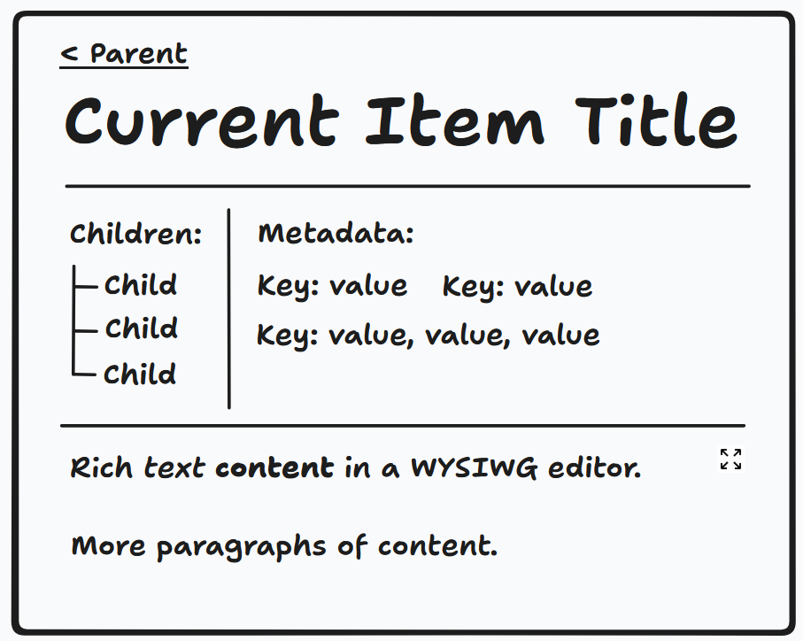

# Frontend

The frontend will use React Router. It will operate in SPA mode. It will fetch data using the React Query tRPC client. It will use Tailwind CSS for styling. It should use Remix icons. It should have a clean, minimal, spacious aesthetic.

## User Interface

The first version of Downdraft will be accessible via a simple web app. This app has a splash screen that lets you create a workspace or go to a workspace that you've previously created. (All routes except the splash screen should start with a workspace ID.) There are two main tabs in the workspace view: the Organizational tab and the Content tab. The Organizational tab is open first, and you can click into it to open a leaflet in the Content tab.

### Organizational Interface

For the initial version of the app, the organizational interface will consist of a tree view of all of the leaflets (the whole forest of trees) that are in the workspace.

### Content Interface

Here is a very rough mockup of the primary content interface:

The title and the link back to the parent item (if it exists) are fairly self-explanatory. The "Children" and "Metadata" sections only appear if
there is something to show in them; in their absence, subtle "Add Children" and "Add Metadata" buttons will be displayed. The "Children" section should have a maximum height and scroll vertically if the content in it overflows.

#### Text Editor

We need a simple WYSIWYG text editor (and a way to convert its contents to Markdown.) As a baseline, it needs standard set of Markdown-friendly formatting options that show up in a tooltip when you highlight some text. For now, let's try the TipTap editor. The formatting buttons should show up in a tooltip when you highlight some text.

It should also have the ability to surface "comments." These comments will be stored in the underlying Markdown in the standard `<!-- -->` way, and thus won't show up when the Markdown is rendered normally, but they should be rendered (with low opacity or something similar that indicates that they aren't normal content) in the editor.

The content should auto-save periodically.

## Demo Workspace

The frontend should have a "demo workspace" that is accessible from the splash screen. This will consist of a series of leaflets that are not persisted and are not loaded from the API that serve to demonstrate the app's functionality. To facilitate this, data-fetching should be encapsulated in hooks (like `useLeaflet` and `useWorkspaceOverview`) that receive a `demo` parameter that defaults to `false`; if this parameter is `true`, fetching from the API should be disabled and in-memory objects should be returned instead.
